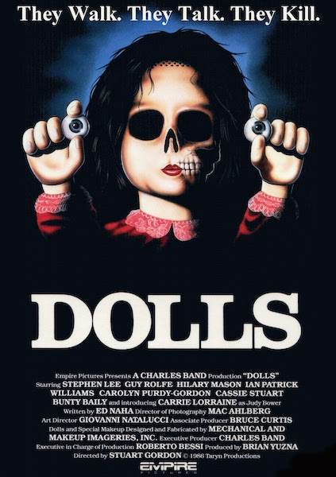

On a dark and stormy night, seven-year-old Judy Bower (Carrie Lorraine) and her abusive guardians take shelter in an eerie house. The owners are a charming-if-strange elderly couple who make dolls.

*Hundreds* of dolls.

Soon other travelers show up: a nice fellow named Ralph (the sadly late Stephen Lee) and a pair of hitchhikers he’s picked up who are…less nice. And then there’s the mysterious giggling, the movement out of the corner of Judy’s eye. But the adults ignore her whenever she tries to tell them about the “elves.” Children, after all, should be seen and not heard—and possibly not even seen. Will Judy survive the “longest night in the world”? Do we care if these other jerks survive it or not?

As a kid, the trailer for *Dolls* scared me to death—and I loved it. But while the movie seven-year-old me imagined was pretty much “the dolls are alive and killing people,” the actual film is a fairy tale at heart. The dolls actually like Judy and want to protect her—unlike, say, Chucky from the *Child’s Play* movies who only looks out for himself. And, frankly, it’s easy to see why the dolls are so fond of Judy: there’s a rawness in Carrie Lorraine’s performance that reminds us of kids we know, of kids we used to be. My favorite scene is when the dolls are attacking Judy’s friend Ralph, and they only stop when she scolds them (“Bad dollies! Bad!”) Even though they were acting in self-defense, they care enough about Judy to listen to her.

In fact, *Dolls* would make a wonderful children’s movie if people weren’t getting gorily stabbed and shot and smashed into walls. What with the dolls’ fierce loyalty to those who love them and the idea that a healthy respect for toys is something no adult should outgrow, the gore seems a bit out of place.

Nevertheless, *Dolls* is a magical film and [Scream Factory’s](https://shoutfactory.com/collections/scream-factory) presentation is full of the love and care it deserves. The transfer is gorgeous, both visually and soundwise: colors are deep and vibrant, and frankly the movie looks and sounds much sharper than I ever thought possible. With the making-of featurette, commentaries with Stuart Gordon, Ed Naha and members of the cast, and new cover art, this release is the definitive edition of *Dolls.* If this and their release of *Motel Hell* are anything to go by, Scream Factory needs more of my money.
